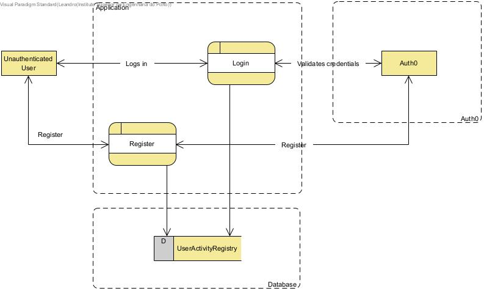
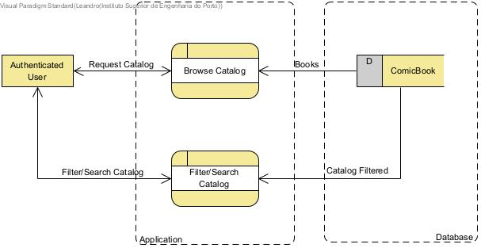
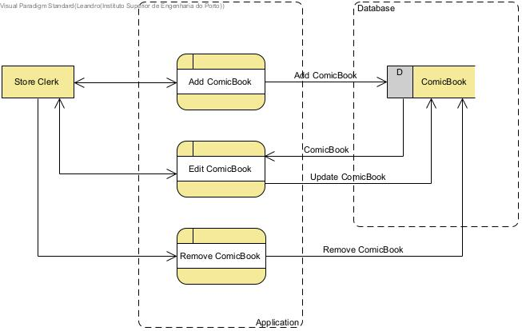
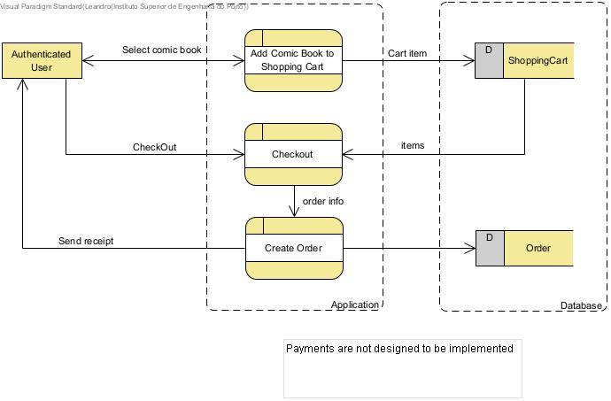

# STRIDE Analysis

### STRIDE is a threat modeling methodology that provides a framework for identifying and mitigating security risks. It stands for Spoofing, Tampering, Repudiation, Information Disclosure, Denial of Service, and Elevation of Privilege.

|       **Threat**       | **Description**                                                                                                            | **Mitigation**                                                                                                                             |
|:----------------------:|:---------------------------------------------------------------------------------------------------------------------------|:-------------------------------------------------------------------------------------------------------------------------------------------|
|        Spoofing        | An attacker could pretend to be a legitimate user by stealing or guessing user credentials.                                | Implementing strong authentication mechanisms like multi-factor authentication, and by securely storing and transmitting user credentials. |
|       Tampering        | An attacker could attempt to modify data in transit between the application and the database, or directly in the database. | Using secure communication protocols (like HTTPS), and by implementing access controls and data integrity checks in the database.          |
|      Repudiation       | A user could deny performing an action, like registering or logging in.                                                    | Keeping detailed logs of user activity, and by implementing non-repudiation mechanisms like digital signatures.                            |
| Information Disclosure | Sensitive user information could be exposed to unauthorized parties during transmission or storage.                        | Encrypting data in transit and at rest, and by implementing strong access controls.                                                        |
|   Denial of Service    | An attacker could overwhelm the system with requests, preventing legitimate users from registering or logging in.          | Implementing rate limiting, and by using scalable and resilient system architectures.                                                      |
| Elevation of Privilege | An attacker could gain unauthorized access to privileged functionalities or data.                                          | Implementing the principle of least privilege, and by regularly reviewing and updating user permissions.                                   |

|       **Threat**       | **Description**                                                                                                            | **Mitigation**                                                                                                                    |
|:----------------------:|:---------------------------------------------------------------------------------------------------------------------------|:----------------------------------------------------------------------------------------------------------------------------------|
|        Spoofing        | Not applicable                                                                                                             | Not Applicable                                                                                                                    |
|       Tampering        | An attacker could attempt to modify the catalog data in transit or directly in the database.                               | Using secure communication protocols (like HTTPS), and by implementing access controls and data integrity checks in the database. |
|      Repudiation       | A user could deny performing an action, like requesting a catalog or filtering/searching a catalog.                        | Keeping detailed logs of user activity.                                                                                           |
| Information Disclosure | If the catalog contains sensitive information, it could be exposed to unauthorized parties during transmission or storage. | Encrypting data in transit and at rest, and by implementing strong access controls.                                               |
|   Denial of Service    | An attacker could overwhelm the system with catalog requests, preventing legitimate users from browsing.                   | Implementing rate limiting, and by using scalable and resilient system architectures.                                             |
| Elevation of Privilege | Not applicable                                                                                                             |                                                                                                                                   |

|       **Threat**       | **Description**                                                                                                                       | **Mitigation**                                                                                                                             |
|:----------------------:|:--------------------------------------------------------------------------------------------------------------------------------------|:-------------------------------------------------------------------------------------------------------------------------------------------|
|        Spoofing        | An attacker could pretend to be a store clerk by stealing or guessing their credentials.                                              | Implementing strong authentication mechanisms like multi-factor authentication, and by securely storing and transmitting user credentials. |
|       Tampering        | An attacker could attempt to modify comic book data in transit between the application and the database, or directly in the database. | Using secure communication protocols (like HTTPS), and by implementing access controls and data integrity checks in the database.          |
|      Repudiation       | A store clerk could deny performing an action, like adding, editing, or removing a comic book.                                        | Keeping detailed logs of user activity, and by implementing non-repudiation mechanisms like digital signatures.                            |
| Information Disclosure | Sensitive comic book information could be exposed to unauthorized parties during transmission or storage.                             | Encrypting data in transit and at rest, and by implementing strong access controls.                                                        |
|   Denial of Service    | An attacker could overwhelm the system with requests, preventing legitimate store clerks from managing comic books.                   | Implementing rate limiting, and by using scalable and resilient system architectures.                                                      |
| Elevation of Privilege | An attacker could gain unauthorized access to privileged functionalities or data.                                                     | Implementing the principle of least privilege, and by regularly reviewing and updating user permissions.                                   |

|       **Threat**       | **Description**                                                                                                                                                   | **Mitigation**                                                                                                                             |
|:----------------------:|:------------------------------------------------------------------------------------------------------------------------------------------------------------------|:-------------------------------------------------------------------------------------------------------------------------------------------|
|        Spoofing        | An attacker could pretend to be a legitimate user by stealing or guessing user credentials.                                                                       | Implementing strong authentication mechanisms like multi-factor authentication, and by securely storing and transmitting user credentials. |                
|       Tampering        | An attacker could attempt to modify order or shopping cart data in transit between the application and the database, or directly in the database.                 | Using secure communication protocols (like HTTPS), and by implementing access controls and data integrity checks in the database.          |                                                                                                                                            
|      Repudiation       | A user could deny performing an action, like adding a comic book to the shopping cart, checking out, or creating an order.                                        | Keeping detailed logs of user activity, and by implementing non-repudiation mechanisms like digital signatures.                            |                                                                                                                                            
| Information Disclosure | Sensitive order or shopping cart information could be exposed to unauthorized parties during transmission or storage.                                             | Encrypting data in transit and at rest, and by implementing strong access controls.                                                        |                                                                                                                                            
|   Denial of Service    | An attacker could overwhelm the system with requests, preventing legitimate users from adding comic books to the shopping cart, checking out, or creating orders. | Implementing rate limiting, and by using scalable and resilient system architectures.                                                      |                                                                                                                                           
| Elevation of Privilege | An attacker could gain unauthorized access to privileged functionalities or data.                                                                                 | Implementing the principle of least privilege, and by regularly reviewing and updating user permissions.                                   |                                                                                                                                            

